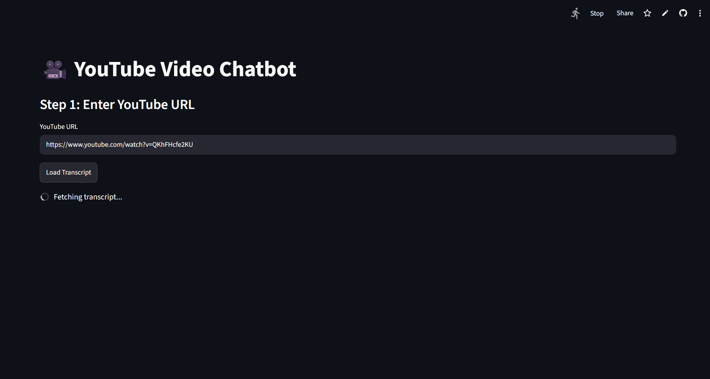
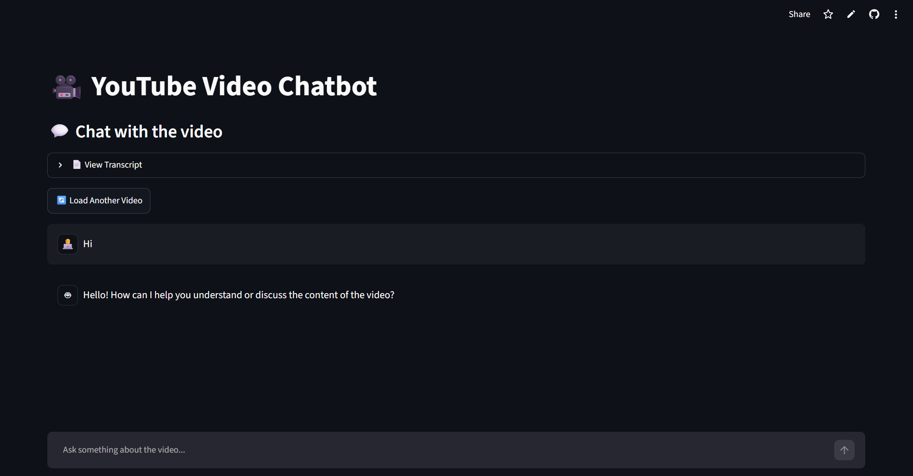
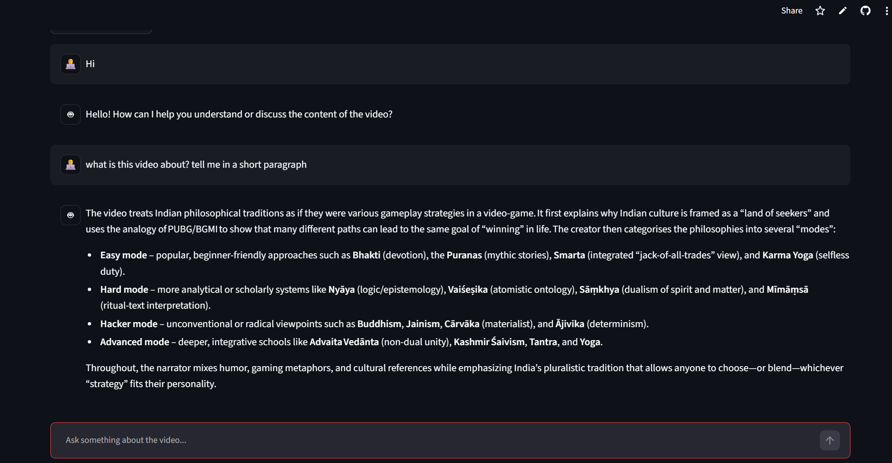
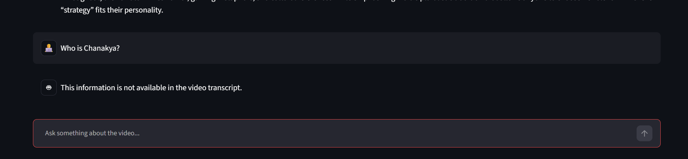
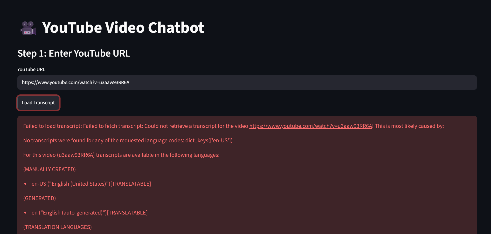
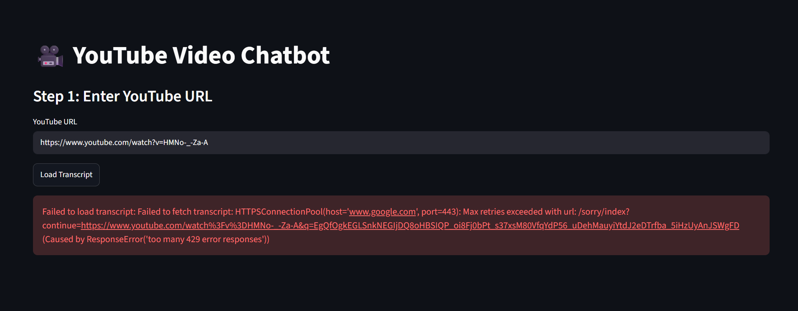

# YouTube Chatbot

A web based chatbot which can chat with you on any youtube video. You only need to provide it with a youtube video URL.

# Usage

Go to https://ytube-chatbot.streamlit.app/ and paste any youtube video URL.

Once the transcript is loaded, you can start chatting with the LLM.

If the transcript does not contain information about the asked prompt from the user, it simply says so.

# Local installation

To get this application on local, you should follow these steps:

1. Clone this repository
2. Run `uv sync`.
3. Run `cd 3_youtube_chatbot`
4. Run `uv run streamlit run app.py`

# Known issues

### Transcaript could not be fetched

### Max retries exceeded

The best solution that I could find for this is to continuously retry.

---
