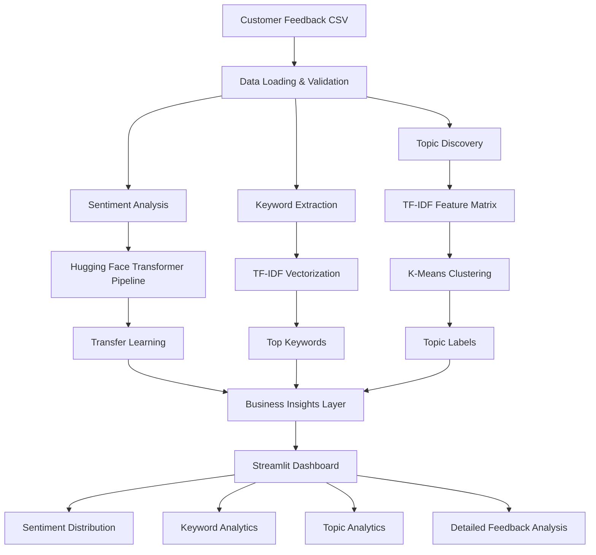

# Customer Feedback Intelligence System

An end-to-end NLP application that transforms raw customer feedback into actionable business insights using modern Natural Language Processing techniques.

The application combines **Transfer Learning**, **Feature Extraction**, and **Unsupervised Learning** to perform:

- Sentiment Analysis
- Keyword Extraction
- Topic Discovery
- Interactive Business Intelligence Dashboard

Built using **Python**, **Hugging Face Transformers**, **Scikit-Learn**, and **Streamlit**.

---

## Live Demo

🚀 **Try the application:**

https://customer-feedback-intelligence-system-cfis.streamlit.app/

---

## Features

### Sentiment Analysis

Uses a pretrained Transformer model from Hugging Face to classify customer feedback as positive or negative.

Concepts demonstrated:

- Transfer Learning
- Transformer Inference
- Pretrained Language Models

---

### Keyword Extraction

Extracts important keywords from customer feedback using TF-IDF.

Concepts demonstrated:

- Feature Extraction
- Text Vectorization
- Information Retrieval

---

### Topic Discovery

Automatically groups similar feedback into topics using K-Means Clustering.

Concepts demonstrated:

- Unsupervised Learning
- Clustering
- Topic Modeling

---

### Interactive Dashboard

Provides an intuitive interface for exploring:

- Sentiment distribution
- Topic distribution
- Top keywords
- Detailed feedback analysis

Built using Streamlit and Plotly.

---

## System Architecture



---

## Technology Stack

| Category         | Technologies              |
| ---------------- | ------------------------- |
| Language         | Python                    |
| NLP              | Hugging Face Transformers |
| Machine Learning | Scikit-Learn              |
| Vectorization    | TF-IDF                    |
| Clustering       | K-Means                   |
| Data Processing  | Pandas                    |
| Dashboard        | Streamlit                 |
| Visualization    | Plotly                    |
| Model Backend    | PyTorch                   |

---

## Project Structure

```text
customer-feedback-intelligence/
│
├── app.py
│
├── services/
│   ├── sentiment_service.py
│   ├── keyword_service.py
│   ├── topic_service.py
│   └── report_service.py
│
├── utils/
│   └── data_loader.py
│
│
├── pyproject.toml
├── uv.lock
└── README.md
```

---

## Getting Started

### Clone the Repository

```bash
git clone <YOUR_GITHUB_REPOSITORY_URL>
cd customer-feedback-intelligence
```

---

## Create Virtual Environment

Using uv:

```bash
uv venv
```

Activate the environment.

### Windows

```bash
.venv\Scripts\activate
```

### Linux / macOS

```bash
source .venv/bin/activate
```

---

## Install Dependencies

Using uv:

```bash
uv add streamlit pandas plotly transformers torch scikit-learn
```

Or if dependencies already exist in the project:

```bash
uv sync
```

---

## Run the Application

```bash
uv run streamlit run app.py
```

The application will be available at:

```text
http://localhost:8501
```

---

## Input Format

Upload a CSV file containing a column named:

```csv
feedback
```

Example:

```csv
feedback
"Login process is confusing and keeps failing"
"Customer support was extremely helpful"
"The dashboard loads very slowly"
"I love the new design improvements"
```

---

## NLP Concepts Demonstrated

This project was built while exploring several foundational NLP concepts:

### Recurrent Neural Networks (RNNs)

Introduced the idea of maintaining contextual information through hidden states.

### Long Short-Term Memory Networks (LSTMs)

Addressed long-term dependency challenges through memory management mechanisms.

### Transfer Learning

Leverages pretrained language models instead of training from scratch.

### Feature Extraction

Uses TF-IDF to convert raw text into meaningful numerical representations.

### Unsupervised Learning

Uses clustering algorithms to discover hidden patterns in customer feedback.

### Transformers

Provides powerful pretrained language representations for sentiment analysis.

---

## Future Enhancements

Potential improvements include:

- Multi-class sentiment analysis
- Aspect-based sentiment analysis
- Named Entity Recognition (NER)
- LLM-powered feedback summarization
- Retrieval-Augmented Generation (RAG)
- Support for local LLMs through Ollama
- Export reports to PDF and Excel

---

## Learning Notes

One of the goals of this project was to connect NLP theory with practical implementation.

Rather than focusing solely on algorithms, the project demonstrates how multiple NLP and machine learning techniques can be combined into a complete, deployable application that solves a real-world business problem.

---

## License

This project is released under the MIT License.
